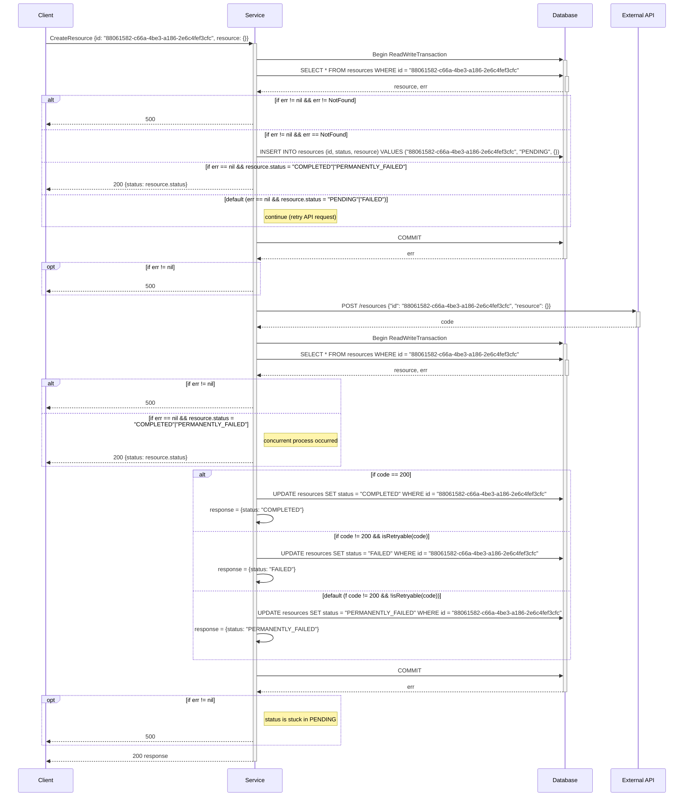
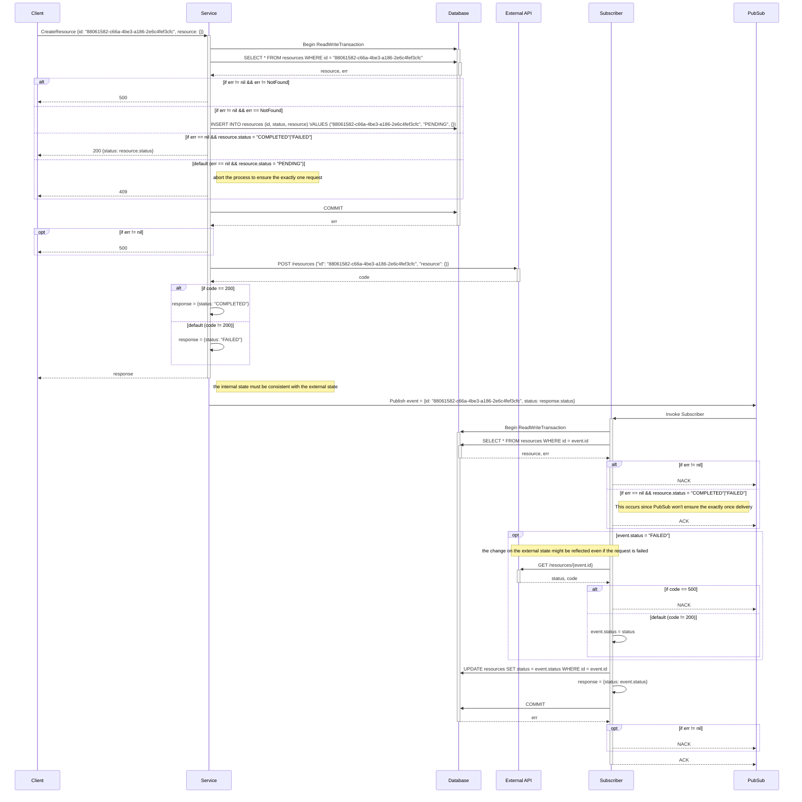

# Idempotent Manager

Design patterns and SDKs for distributed transactions ensuring consistency between internal state and external APIs.
Includes techniques for achieving idempotency, chaos engineering validation, and solutions for non-idempotent external APIs.

外部APIとデータベースの整合性を保証するための設計パターン

形式証明 (TLA+) による設計のシーケンスの妥当性は、

## 楽観的アプローチ (Optimistic Approach)

外部APIが冪等である場合に有効なアプローチ

### 特徴

メリット

* 並列可能性
* デッドロックの回避

デメリット

* at least once のリクエストが発生する

### 実装

## 悲観的アプローチ (Pessimistic Approach)

外部APIが冪等でない場合に有効なアプローチ

### 特徴

メリット

* exactly once のリクエストが発生する

デメリット

* 悲観的ロックによる並列可能性の低下
* デッドロックの危険性
* 非同期処理の複雑性

### 実装

